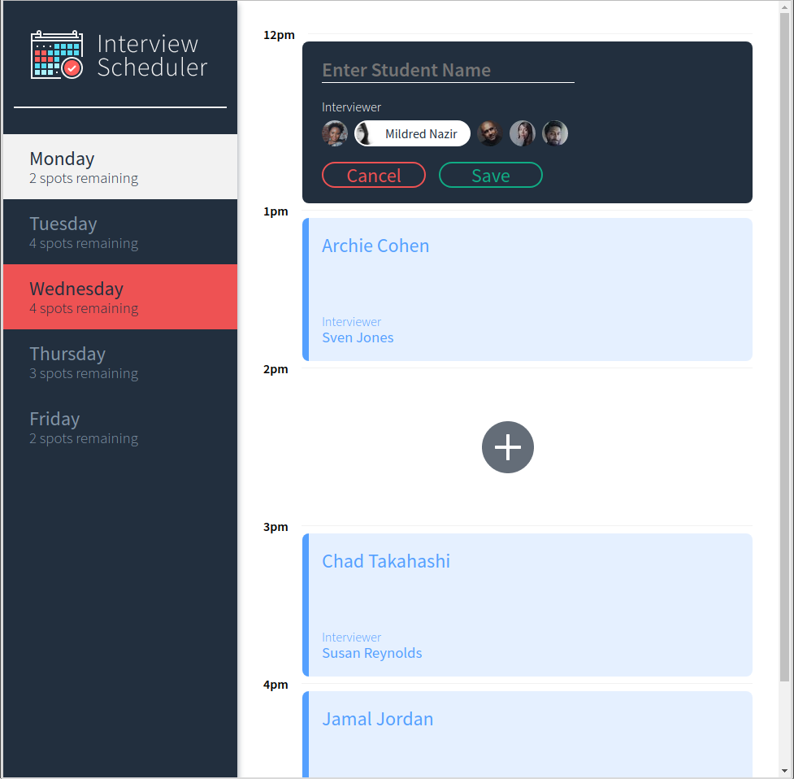
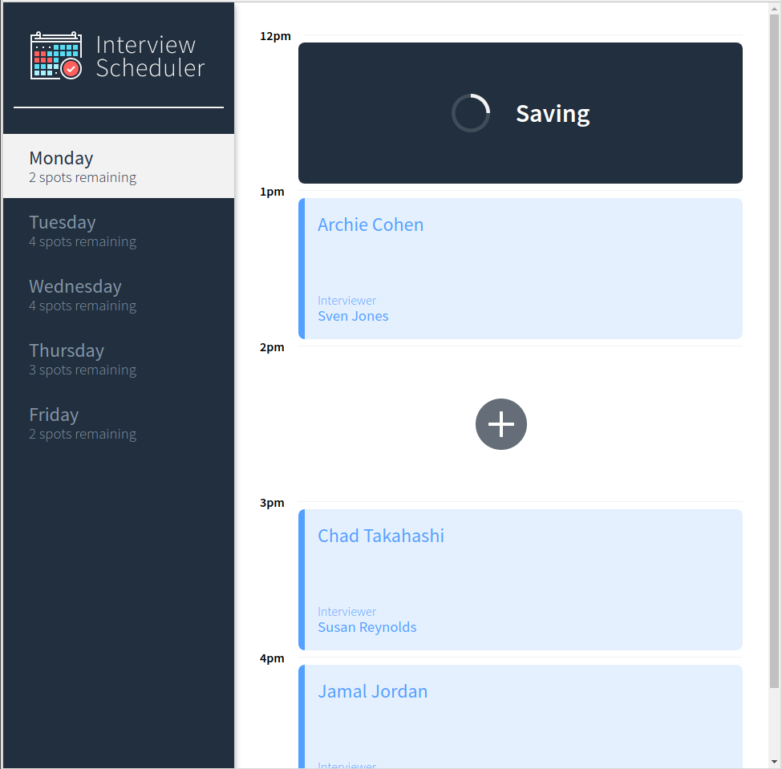

# Interview Scheduler

Interview Scheduler is a single page web app that allows for the booking and cancelling of student/mentor sessions.  Built with ReactJS, Webpack with Babel, JSX, ES6, SCSS, and JSON.  Full testing coverage with JEST and Cypress.

## Authors

* **John Webster** - *Project completion* - [RandomHilarity](https://github.com/RandomHilarity)
* **Lighthouse Labs** - *Initial project skeleton* - [lighthouse-labs](https://github.com/lighthouse-labs/)

## Final Product




## Dependencies

- Axios
- Classnames
- Normalize.css
- React
- React-dom
- React-scripts

## Dev Dependencies

- Babel
- Storybook
- prop-types
- react-test-renderer

## Setup

Install dependencies with `npm install`.

Requires scheduler-api for backend.
<https://github.com/lighthouse-labs/scheduler-api>

## Running Webpack Development Server

```sh
npm start
```

## Running Jest Test Framework

```sh
npm test
```

## Running Storybook Visual Testbed

```sh
npm run storybook
```

## Running Cypress EtE

```sh
npm run cypress
```
